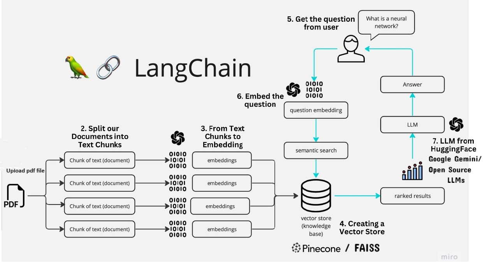

# AI_ML_ASSIGNMENT
QA bot for PDF files to extract text, generate embeddings, and store them in a vector database. Users can query the system, which retrieves relevant text chunks based on similarity scores. The system integrates with a GPT model for refining user queries.
## Requirement
1. PineCone Api Key (https://www.pinecone.io/)
2. OpenAI Key (https://platform.openai.com/)
   
## Steps
1. Open google colab from https://colab.research.google.com/
2. Upload supported document (asd.pdf) to sesson storage
3. Upload Mayank_Singh_LLM_Assigenment_latest.ipynb
4. and run the code

##  Architecture Document:
------------
The application follows these steps to provide responses to your questions:

1. **PDF Loading** : The app reads multiple PDF documents and extracts their text content.

2. **Text Chunking** : The extracted text is divided into smaller chunks that can be processed effectively.

3. **Language Model** : The application utilizes a language model to generate vector representations (embeddings) of the text chunks.

4. **Similarity Matching** : When you ask a question, the app compares it with the text chunks and identifies the most semantically similar ones.

5. **Response Generation** : The selected chunks are passed to the language model, which generates a response based on the relevant content of the PDFs.

